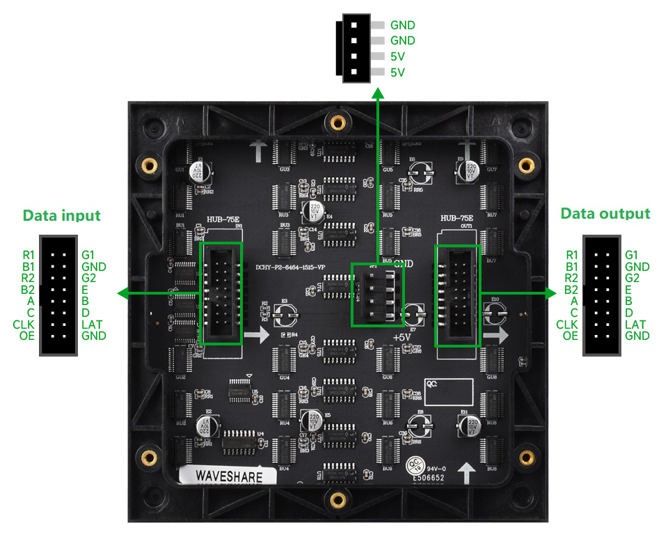
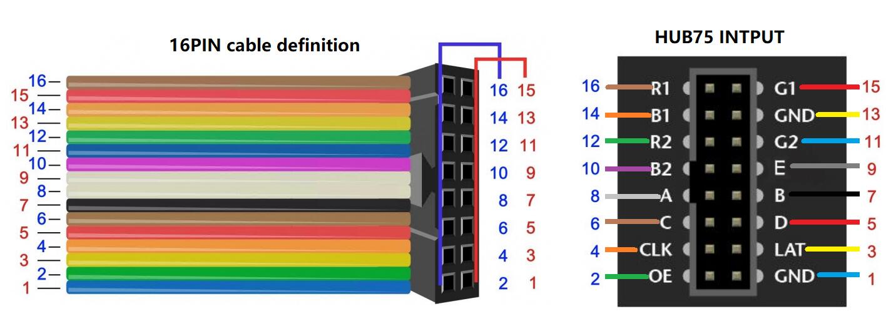

# LED Array Control for Quantitative Phase Imaging

ESP32 firmware for driving a [Waveshare RGB-Matrix-P2-64x64](https://www.waveshare.com/wiki/RGB-Matrix-P2-64x64) HUB75 LED panel one pixel at a time, designed for use as a programmable illumination source in quantitative phase imaging setups.

Two variants are provided:

| Folder | Advance mode |
|---|---|
| `LED_sequence_no_trigger/` | Auto-steps every 500 ms (free-running) |
| `LED_sequence_with_trigger/` | Steps on an external hardware trigger |

Both share the same HUB75 driver, sequence logic, and configuration format.

## How it works

### Overdriven single-pixel output

A HUB75 panel is normally multiplexed: the controller scans through 32 row-pairs in rapid succession, giving each row a brief timeslice (duty cycle ~1/32). This is fine for displaying images, but each LED is dim because it is only lit ~3% of the time.

These sketches exploit the fact that only **one LED needs to be on at any moment**. Instead of scanning all rows, the firmware:

1. Disables the display output (`OE` HIGH).
2. Shifts the target pixel's data into the correct row-pair via the shift registers.
3. Latches the data and selects the row address.
4. **Leaves `OE` permanently LOW** -- the selected row stays lit continuously.

Because there is no scanning, the active LED receives **~32x the drive current duty cycle** compared to normal operation. This overdrives the LED well beyond the panel's rated (pulsed) operating point, producing a much brighter point source -- which is exactly what the phase imaging optical path requires.

This is safe in practice because only a single LED draws current at any time, keeping total board power well within limits.

### Sequence stepper

Both variants use a `BoundStepper` that walks a grid of positions defined in `config_sequence.h`:

```
(START_COL, START_ROW)  -->  +STEP_COL  -->  ...  -->  END_COL
        |
     +STEP_ROW
        |
       ...  -->  END_ROW  -->  wrap back to start
```

On each advance the column index increases by `STEP_COL`. When it reaches `END_COL` the column resets to `START_COL` and the row increases by `STEP_ROW`. When the row reaches `END_ROW` the whole sequence wraps back to the beginning (if `LOOP_FOREVER` is true).

### Configuration (`config_sequence.h`)

| Parameter | Description |
|---|---|
| `W`, `H` | Panel dimensions (pixels) |
| `USE_RED`, `USE_GREEN`, `USE_BLUE` | Which color channel(s) to light |
| `START_ROW`, `START_COL` | First position in the sequence |
| `END_ROW`, `END_COL` | Boundary at which the axis wraps |
| `STEP_COL`, `STEP_ROW` | Increment per step along each axis |
| `LOOP_FOREVER` | `true` to cycle indefinitely, `false` to stop and blank |

### Hardware

The panel is a [Waveshare RGB-Matrix-P2-64x64](https://www.waveshare.com/wiki/RGB-Matrix-P2-64x64) (2 mm pitch, HUB75E interface):



The 16-pin ribbon cable pinout and corresponding HUB75 input header:



### Wiring (`config_hardware.h`)

Pin mapping for the HUB75E interface on an ESP32:

| Signal | GPIO |
|---|---|
| R1 / G1 / B1 | 25 / 26 / 27 |
| R2 / G2 / B2 | 14 / 12 / 13 |
| A / B / C / D / E | 23 / 22 / 18 / 33 / 32 |
| CLK / LAT / OE | 5 / 4 / 15 |
| TRIG (input) | 35 |

## Free-running mode (`LED_sequence_no_trigger/`)

The simplest variant. The stepper advances automatically every 500 ms (`STEP_DELAY_MS`). Useful for testing and alignment without an external trigger source.

## Hardware-triggered mode (`LED_sequence_with_trigger/`)

Designed for synchronization with a camera or other acquisition hardware. The LED advances only when an external trigger pulse is received on `TRIG_PIN` (GPIO 35).

### Trigger mechanism

The trigger system uses an interrupt-driven approach with debouncing and re-arm logic to ensure reliable one-shot-per-pulse behavior:

**ISR (`onTrigISR`)** -- attached to the rising (or falling) edge of `TRIG_PIN`:
1. If not `armed`, the edge is ignored.
2. If less than `MIN_GAP_US` (5 ms) has elapsed since the last accepted edge, the edge is ignored (debounce).
3. Otherwise the trigger is accepted: the counter increments, a flag is set, and the ISR **disarms itself**.

**Re-arm (`tryRearm`)** -- polled in `loop()`:
- Requires `TRIG_PIN` to stay LOW for at least `LOW_REARM_US` (3 ms) continuously before re-arming.
- This prevents a noisy or bouncing signal from generating multiple triggers per intended pulse.

**Trigger filtering** -- in `loop()`:
- `START_AT` controls how many triggers to skip before the first advance (useful to ignore an initial burst).
- `TRIG_INTERVAL` controls the decimation ratio: the stepper advances once every N accepted triggers.

### Trigger timing parameters (`config_hardware.h`)

| Parameter | Default | Description |
|---|---|---|
| `TRIG_PIN` | 35 | Input pin (input-only on ESP32, no internal pull) |
| `TRIG_ON_RISING` | `true` | `true` for rising-edge, `false` for falling-edge |
| `MIN_GAP_US` | 5000 | Minimum microseconds between accepted edges |
| `LOW_REARM_US` | 3000 | How long the pin must stay LOW before re-arming |
| `START_AT` | 1 | First trigger count that causes an advance |
| `TRIG_INTERVAL` | 1 | Advance every N-th accepted trigger |
